# Terrabuzz - A Student Social Media Application

 

[![Contributors][contributors-shield]][contributors-url]
[![Forks][forks-shield]][forks-url]
[![Stargazers][stars-shield]][stars-url]
[![Issues][issues-shield]][issues-url]

- Rubix982, Saif Ul Islam, [![LinkedIn - Rubix982][linkedin-shield]][linkedin-url-rubix982]
- Hassanzhd, Muhammad Hassan Zahid, [![LinkedIn - Hassanzhd][linkedin-shield]][linkedin-url-Hassanzhd]
- TashikMoin23, Tashik Moin Sheikh, [![LinkedIn - TashikMoin23][linkedin-shield]][linkedin-url-tashikMoin23]
- HasanBurney, Hasan Burney [![LinkedIn - HasanBurney][linkedin-shield]][linkedin-url-hasanburney]

<!-- PROJECT LOGO -->
 

  

  <h3 align="center">Terrabuzz</h3>

  

    A student social media project
     
    <a href="https://drive.google.com/file/d/1EMZb2H9-jMr69Ac4kvM5gi9LASd5B79q/view"><strong>Read the SRS/SDS»</strong></a>
     
     
    <a href="https://github.com/Rubix982/Terrabuzz">Video Demo</a>
    ·
    <a href="https://github.com/Rubix982/Terrabuzz/issues/new?assignees=&labels=&template=bug_report.md&title=">Report Bug</a>
    ·
    <a href="https://github.com/Rubix982/Terrabuzz/issues/new?assignees=&labels=&template=feature_request.md&title=">Request Feature</a>
  

----------

<!-- TABLE OF CONTENTS -->

  
Table of Contents

  <ol>
    <li>
        <a href='#description'>Description</a>
    </li>
    <li>
      <a href="#about-the-project">About The Project</a>
    </li>
    <li>
      <a href='#screenshots'>Screenshots</a>
    </li>
    <li>
      <a href='#demos'>Demos</a>
      <ul>
        <li><a href="#using-demo">Run Demo</a></li>
        <li><a href="#workflow-explanation">Workflow Explanation</a></li>
      </ul>
    </li>
    <li>
      <a href="#file-structure">File Structure</a>
      <ul>
        <li><a href="#client">Client</a></li>
        <li><a href="#data">Data</a></li>
        <li><a href="#docs">Docs</a></li>
        <li><a href="#server">Server</a></li>  
        <li><a href="#web-server">Web Server</a></li>           
      </ul>
    </li>
    <li>
      <a href="#getting-started">Getting Started</a>
      <ul>
        <li><a href="#prerequisites">Prerequisites</a></li>
        <li><a href="#installation">Installation</a></li>
      </ul>
    </li>
    <li><a href="#roadmap">Roadmap</a></li>
    <li><a href="#contributing">Contributing</a></li>
    <li><a href="#license">License</a></li>
    <li><a href="#contact">Contact</a></li>
    <li><a href="#acknowledgements">Acknowledgements</a></li>
  </ol>

----------

<!-- Description-->
## Description

Finding relations among people is one of the hardest things to do with social media these days, contrary to the word social media in the first place. More and more emphasis is put on driving a great amount of reactions, rather than focusing on helping people find more connections far more easily than others.

What does this mean? It means that there are lower chances or possibilities for artists, small business, startups, to more easily connect with their audience.
Social media really should be about socializing and finding it easier to connect and find people similar to your interest, and finding relationships between what people like and what they post content about is the main purpose for this creation.
Inspired by the research and idea carried forward by graph databases, the main motivation and idea for this was to enable people to connect to other people far more easily. Focusing on actual quality of content, and not just quantity of content.

----------

<!-- ABOUT THE PROJECT -->
## About The Project

Terrabuzz is just this, a social media website that emphasizes on building relations with people, and helping people figure out similar groups of communities.

It will focus on having a homepage - a feed view, a profile page for each user, and the ability to search for other users meant to find other connections.

----------

## Screenshots

1. Home page when logged out 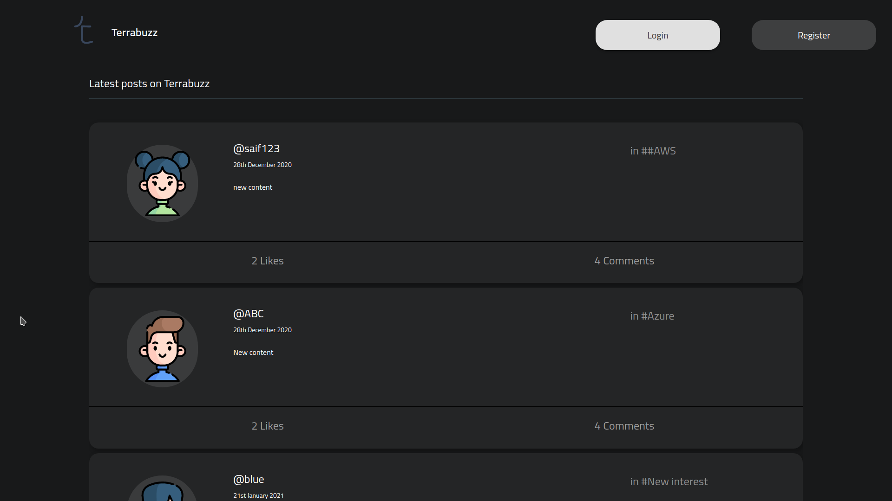
2. Registration page 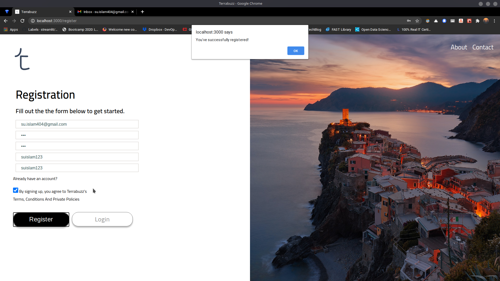
3. Verification email 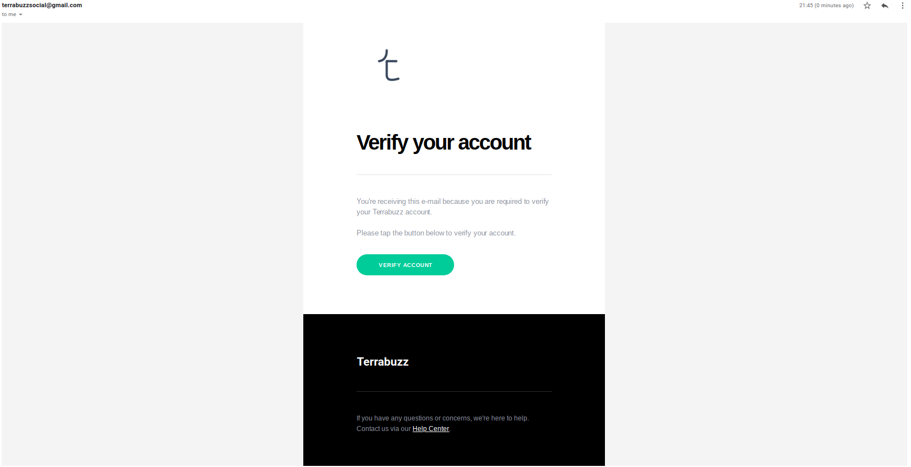
4. Login page 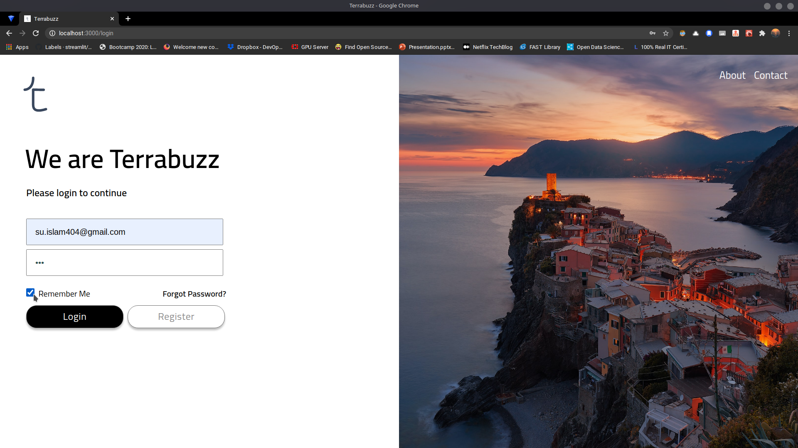
5. First login page 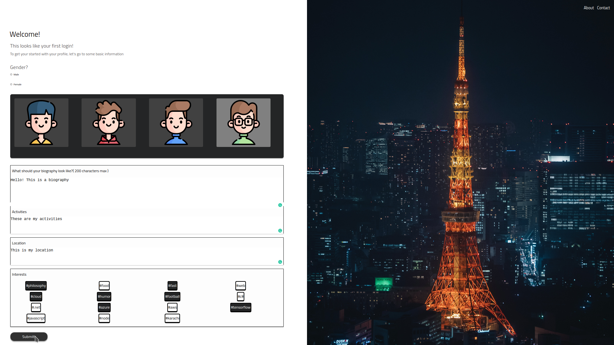
6. Basic newsfeed 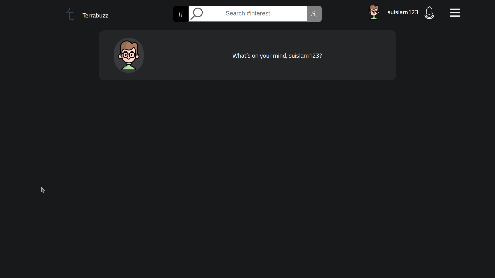
7. Profile page 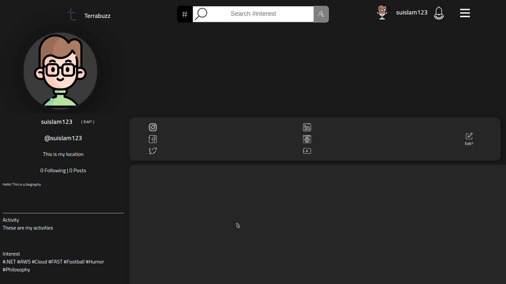
8. Modal to change information 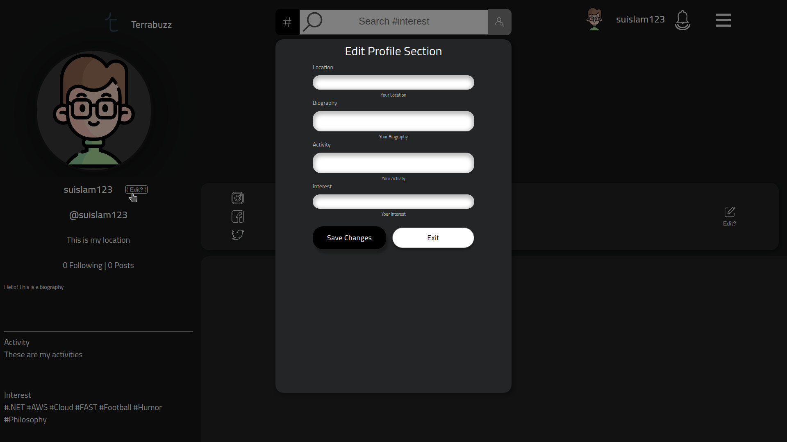
9. Searching for profiles that have an interest 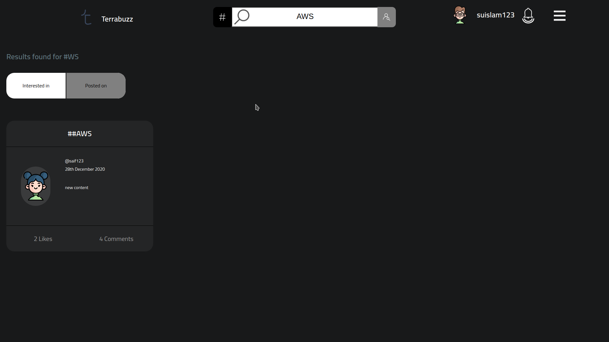
10. Searching for profiles based on user handle 
11. Settings dropdown with the notification page in the background. No notifications generated, thus, no notifications displayed at the moment for this new account 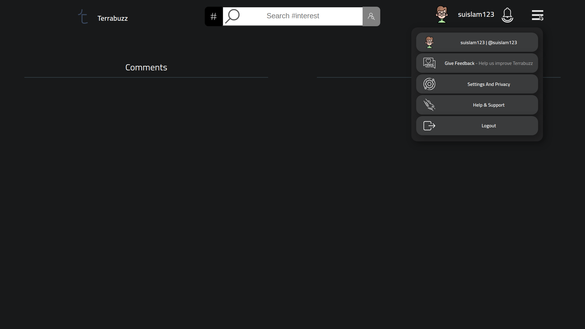
12. Individual post page 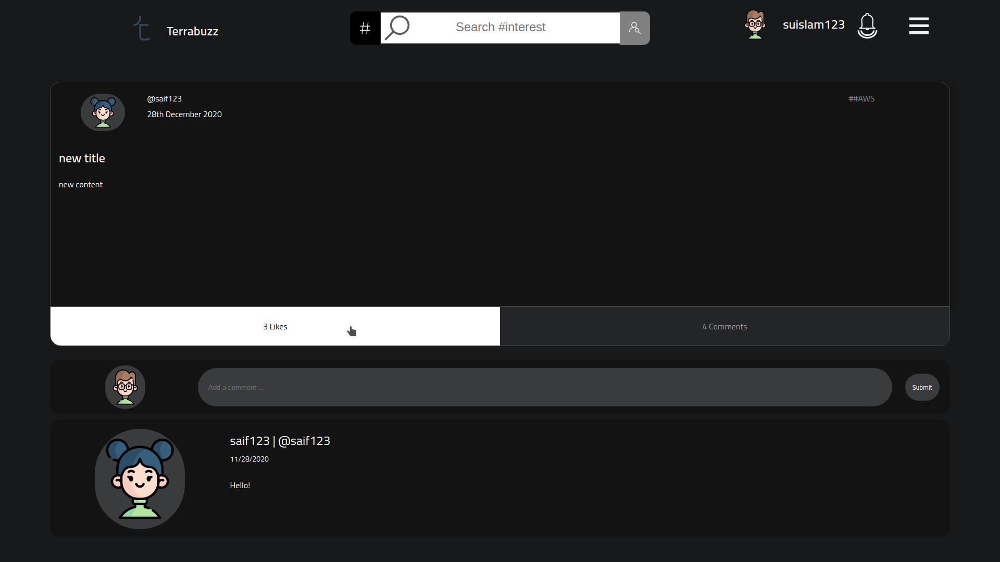
13. Profile page of another user, who is being followed ( denoted by the red cross symbol ) 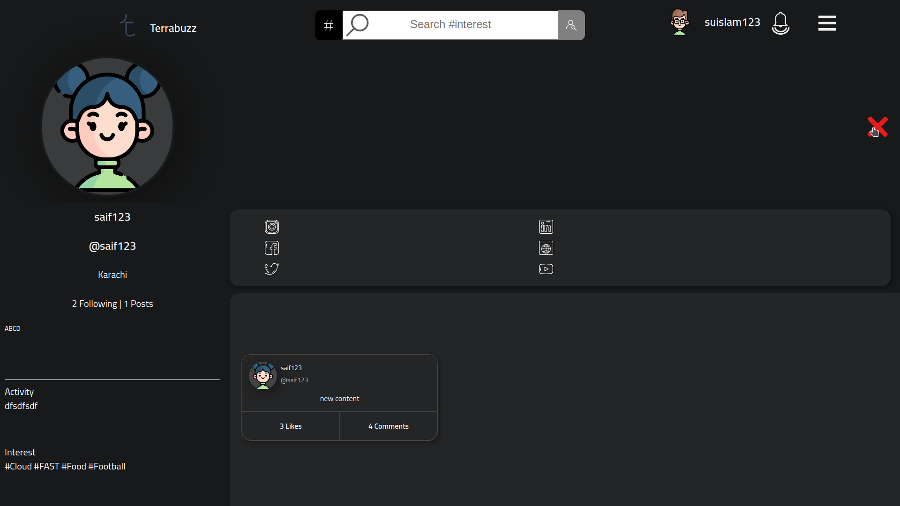
14. Post shown after connecting with user 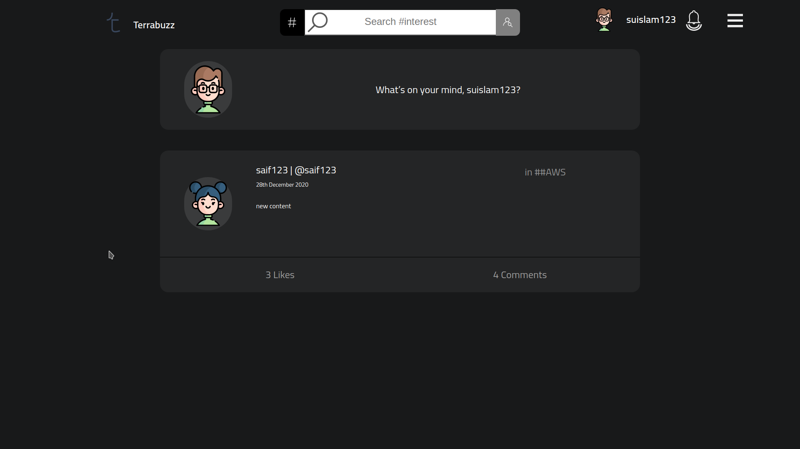
15. Settings page 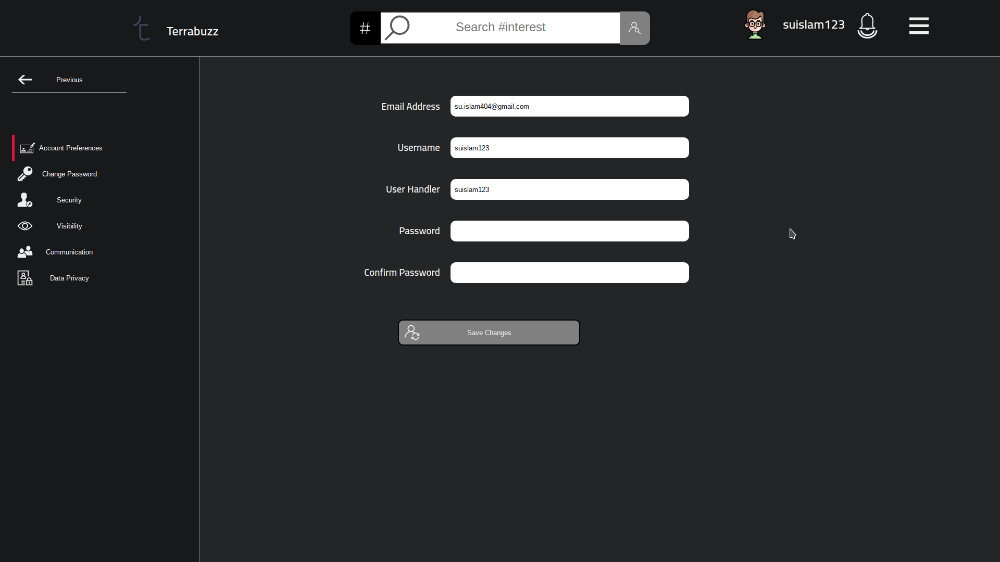

----------

<!-- YOUTUBE DEMOS -->
## Demos

<!-- Using The Application Demo -->
### Using Demo

YT link to video a video showing the project demo will be placed here

<!-- WORKFLOW EXPLANATION -->
### Workflow Explanation

YT link to video explaining the workflow of the project will be placed here

----------

<!-- FILE STRUCTURE -->
## File Structure

This sections explains the file structure for the whole project

<!-- ROOT -->
### Root Directory

<!-- CLIENT -->
### Client

The client directory contains the entirety of the frontend application. This means the ReactJS code with different sections designed, for example,

- `public` directory contains information for the basic React application
- `src` contains the pages, components, and the assets used for the pages
    - `API` contains the API object, which can send GET and POST requests to the backend specified via a .env file located under `client`
    - `assets` contains the individual pages as directories to segregate the different mutlimedia files
    - `components` also contains a segregation. Each folder inside `components` is marked with the page component that uses those component. Each folder must have a `MainContent.js` that arranges and organizes all the other components within the folder, if they exist. Errors thrown here render an error page on the web browser tab
    - `pages` contain single page views for a specified URL
    - `services` contains the client side logic for dealing and handling the payloads. The error messages that occur here are displayed within the Chrome Dev Tool's console.
    - `styles` is also separated into folders, each folder contains individual files for each component used respectively under `components`, and each file is suffixed with `.module.css` to make sure that styling is only applied to the component it is used in
    - `App.js` contains the routing for the individual pages. Here, there is slight logic on how to deal with logged in and logged out user, and specifies the routes that will be visited when a specific URL is hit
    - `index.js` simply imports the `App` component from `App.js` with `React.StrictMode`
    - `serviceWorker.js` registers a new worker ( to be explained because this code came with ReactJS - I'm still not sure what this does exactly )
    - `setupTests.js`, just importing the Jest libary for testing. 
- `.eslintignore`, ignore running lint on some files
- `.eslintrc.js`, exports an object that configures the ES Lint run before each commit is performed
- `Dockerfile`, Docker file to build the `client` container
- `package.json`, contains the respective dependencies
- `package-lock.json`, lock file for package.json
- `README.md`, basic documentation generated by ReactJS

<!-- DATA -->
### Data

This folder is reserved space to allow volume mapping within the containers. Do not alter this or modify this. On forcefully removing this location, please build the containers again to safely allow volume mapping.

<!-- DOCS -->
### Docs

Contains the `Software Requirement Specification` (SRS) and `Software Development Specification` (SDS) written for the project. Also contains some basic images for this README.md

<!-- SERVER -->
### Server

Contains the entirety of the backend code, written in ExpressJS. The explanations for the subdirectory are as follows,

- `config`, we initially created this ... but really didn't do anything with it. There's an empty `index.js` for now. Future expansion is most probably expected
- `controllers`, requests after being properly routed, are sent to their respective controller functions here. The functions specified for each route really just cares about the 
- `db`, contains the connector bindings for the databases used. Each folder is separately for each database with it's respective connector
- `middleware`, contains some middleware function to check for correct login, and for authenticating the user
- `models`, the classes and views created for Mongoose and MySQL2 to provide an easy way of dealing with the connectors and saving information
- `routes`, specifies the endpoints to hit for GET and POST requests
- `services`, here, queries are sent to the underlying databases in containers to perform CRUD operations
- `tests`, any tests needed should be sent here
- `www`, making sure the PORT is open

<!-- WEB SERVER -->
### Web Server

The web server acts as an intermediary between the client side container and the backend container by mounting client at `/`, and backend at `/api/`.

The file structure is as follows,

- `nginx.conf`, basic NGINX configuration
- `Dockerfile`, sets up the docker container for nginx
- `conf.d/default.conf`, mounting location for `/api/`

----------

<!-- GETTING STARTED -->
## Getting Started

This is dedicated to setting the software up

<!-- PRE REQUISITES -->
### Prerequisites

You need to simply have Docker on your machine! Everything is dockerized, which means to build and run the project, you don't need to install any other software - Docker pulls that for you.

- If you're on Windows, check out "[Install Docker Desktop on Windows](https://docs.docker.com/docker-for-windows/install/)"
- If you're on Linux, check out "[https://docs.docker.com/compose/install/](https://docs.docker.com/compose/install/)" and "[Install Docker Engine on Ubuntu](https://docs.docker.com/engine/install/ubuntu/)"

<!-- INSTALLATION -->
### Installation

If you're on `Linux`, simply run `make build`. You can interrupt the containers anytime by pressing `Ctrl^C`. If you want to remove the containers, run `make remove`. If you want to start them again, just run `make up`. Check out the `Makefile` for more instructions.

If you're on `Windows`, simply visit the root of the project via the command line, and run `docker-compose -f docker-compose.dev.yaml up --build`, and it should start.

The team developed, built, and tested this project on Linux. If there a issue with the Window's equivalent of commands, let us know in the issues tab! :D

----------

<!-- ROADMAP -->
## Roadmap

See the [open issues](https://github.com/Rubix982/Terrabuzz/issues) for a list of proposed features (and known issues).

----------

<!-- CONTRIBUTING -->
## Contributing

Contributions are what make the open source community such an amazing place to be learn, inspire, and create. Any contributions you make are **greatly appreciated**.

1. Fork the Project
2. Create your Feature Branch (`git checkout -b feature/AmazingFeature`)
3. Commit your Changes (`git commit -m 'Add some AmazingFeature'`)
4. Push to the Branch (`git push origin feature/AmazingFeature`)
5. Open a Pull Request

----------

<!-- CONTACT -->
## Contact

Email,

- Saif Ul Islam, saifulislam84210@gmail.com
- Muhammad Hassan Zahid, hassanzhd2000@gmail.com
- Tashik Moin Sheikh, tashikmoinsheikh@gmail.com 
- Hasan Burney, hasanburney@outlook.com

<!-- ACKNOWLEDGEMENTS -->
## Acknowledgements
* [GitHub Emoji Cheat Sheet](https://www.webpagefx.com/tools/emoji-cheat-sheet)
* [Img Shields](https://shields.io)
* [Choose an Open Source License](https://choosealicense.com)
* [GitHub Pages](https://pages.github.com)
* [Animate.css](https://daneden.github.io/animate.css)
* [Loaders.css](https://connoratherton.com/loaders)
* [Slick Carousel](https://kenwheeler.github.io/slick)
* [Smooth Scroll](https://github.com/cferdinandi/smooth-scroll)
* [Sticky Kit](http://leafo.net/sticky-kit)
* [JVectorMap](http://jvectormap.com)
* [Font Awesome](https://fontawesome.com)

# Todo

- Improve this README
- Make and upload a live video representation on how to use this template
- Plan out how to structure the documentation
- Make project planning and building as automated as possible

<!-- MARKDOWN LINKS & IMAGES -->
<!-- https://www.markdownguide.org/basic-syntax/#reference-style-links -->
[contributors-shield]: https://img.shields.io/github/contributors/Rubix982/ASP.NET-ReactJS-Template.svg?style=for-the-badge
[contributors-url]: https://github.com/Rubix982/ASP.NET-ReactJS-Template/graphs/contributors
[forks-shield]: https://img.shields.io/github/forks/Rubix982/ASP.NET-ReactJS-Template.svg?style=for-the-badge
[forks-url]: https://github.com/Rubix982/ASP.NET-ReactJS-Template/network/members
[stars-shield]: https://img.shields.io/github/stars/Rubix982/ASP.NET-ReactJS-Template.svg?style=for-the-badge
[stars-url]: https://github.com/Rubix982/ASP.NET-ReactJS-Template/stargazers
[issues-shield]: https://img.shields.io/github/issues/Rubix982/ASP.NET-ReactJS-Template.svg?style=for-the-badge
[issues-url]: https://github.com/Rubix982/ASP.NET-ReactJS-Template/issues
[linkedin-shield]: https://img.shields.io/badge/-LinkedIn-black.svg?style=for-the-badge&logo=linkedin&colorB=555
[linkedin-url-rubix982]: https://www.linkedin.com/in/saif-ul-islam-93786b187/
[linkedin-url-Hassanzhd]: https://www.linkedin.com/in/muhammad-hassan-zahid-b110971b6/
[linkedin-url-tashikMoin23]: https://www.linkedin.com/in/tashik-moin-sheikh-08872116b/
[linkedin-url-hasanburney]: https://www.linkedin.com/in/hasanburney/
[product-screenshot]: images/screenshot.png
